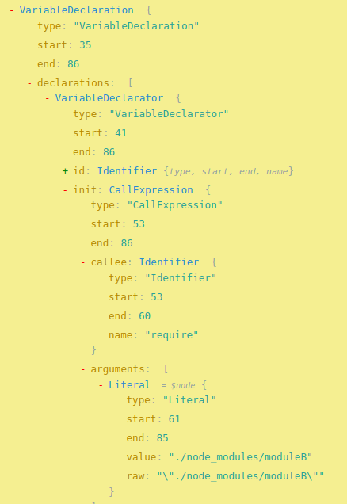

## Dependency Tree Breakdown

<div style="display: flex; justify-content: center; gap: 100px;">


</div>

---

<h1>Agenda</h1>
<div style="display: flex; justify-content: center; gap: 50px;">
<div style="display: flex; flex-direction: column;">
<ol>
    <li>What is a Dependency Tree</li>
    <li>Initialisation</li>
    <li>Parsing</li>
    <li>Identifying Dependencies</li>
    <li>Resolve Dependency Paths</li>
    <li>Recursive Traversal</li>
    <li>What is this for?</li>
    <li>Example</li>
</ol>
</div>

</div>

---

# What is a Dependency Tree?

---

It's a Directed Acyclic Graph (DAG) where nodes represent modules (files) and edges represent dependencies between these modules.

---


---

We can represent a DAG in code using an adjacency list, which is a collection of lists or sets. Each node has a list of nodes it depends on.

---


---


---


---

# Initialisation

---

- The process of finding dependencies will start from the page/file that is loaded initially.
- This is typically an `index` file. (`index.js`)

```JavaScript
1 const entryFilePath = path.resolve(__dirname, 'index.js');
```


---

# Parsing

---

- The entry file is read and parsed to identify all the `import` or `require` statements.
- Parsing involves converting the code into an **Abstract Syntax Tree** (AST), which we won't go over as Khai and Myself have spoken about this.

---

- We will do this part in the example with the help of a JS parser _Acorn_.

```JavaScript
1 // Read the file
2 const content = fs.readFileSync(entryFilePath, 'utf-8');
3 // Parse the file
4 const ast = acorn.parse(content, { sourceType: 'module' });
```

---

# Identify Dependencies

---

- Now we have our AST, we need go searching through it!
- We simply want to search for `imports` and `require` statements.
- Import statements are called **ImportDeclaration** in the AST.
- `require` statements are **CallExpressions**, so we need to do some additional checks to make sure it is a dependency.

---


---


---


---



---

```JavaScript
1 const dependencies = [];
2 walk.simple(ast, {
3   ImportDeclaration(node) {
4     dependencies.push(node.source.value);
5   },
6   CallExpression(node) {
7     if (node.callee.name === 'require' && node.arguments.length === 1) {
8       const argument = node.arguments[0];
9       if (argument.type === 'Literal') {
10         dependencies.push(argument.value);
11       }
12     }
13   }
14 });
```

---


# Resolve Dependency Paths

---

- We want to convert relative paths to absolute paths to ensure consistency and avoid path conflicts.

```JavaScript
1 const resolvePath = (basePath, relativePath) =>
            path.resolve(path.dirname(basePath), relativePath);

```

---

# Recursive Traversal

<div style="display: flex;gap: 30px">
<div>
<ul>
<li>For each identified dependency, add nodes (modules) and edges (dependencies) to the graph.</li>
<li>Apply this same dependency extraction process to each dependency until all modules are processed.</li>
</ul>
</div>
<div>

</div>
</div>

---

```JavaScript
1 function buildDependencyTree(entryFilePath) {
2   const graph = new Graph();
3   const stack = [entryFilePath];
4   const visited = new Set();
5   const pathStack = [];
6
7   while (stack.length > 0) {
8     const currentFilePath = stack.pop();
9     if (visited.has(currentFilePath)) continue;
10
11     if (pathStack.includes(currentFilePath)) {
12       console.warn(
13         `Cyclic dependency detected: ${pathStack.join(
14           " -> "
15         )} -> ${currentFilePath}`
16       );
17       continue;
18     }
19
20     visited.add(currentFilePath);
21     pathStack.push(currentFilePath);
22     graph.addNode(currentFilePath);
23
24     const dependencies = getDependencies(currentFilePath);
25     for (const dep of dependencies) {
26       const depFilePath = resolvePath(currentFilePath, dep);
27       graph.addNode(depFilePath);
28       graph.addEdge(currentFilePath, depFilePath);
29       stack.push(depFilePath);
30     }
31
32     pathStack.pop();
33   }
34
35   return graph;
36 }
```

---

# What is this used for?

Now we have a structured representation of how modules depend on each other.
This enables the bundler to correctly order and include modules, and optimise code.

---

# Live Example


---


---


---


---
